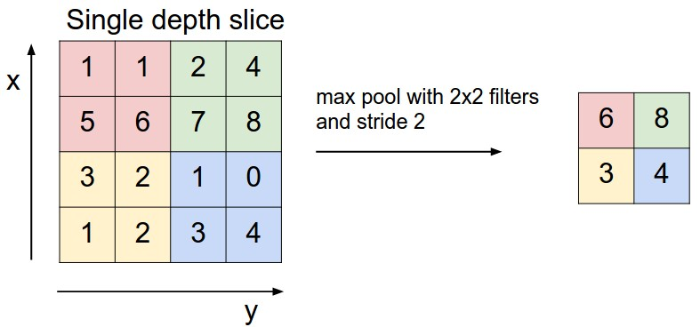
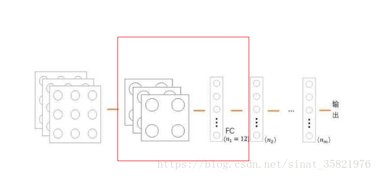
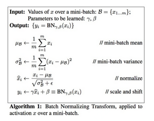
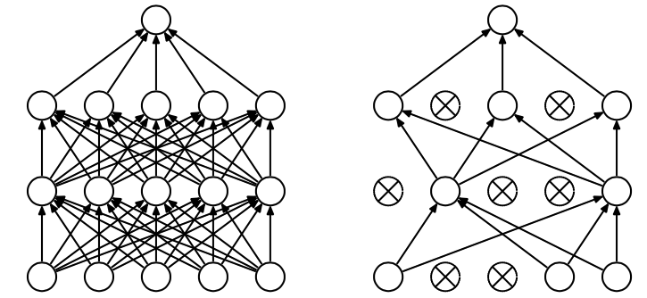
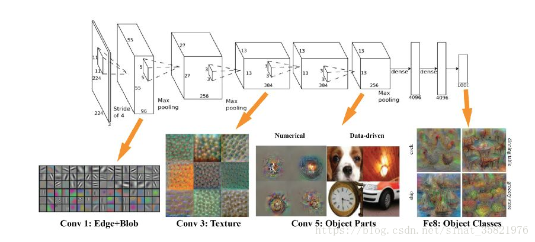
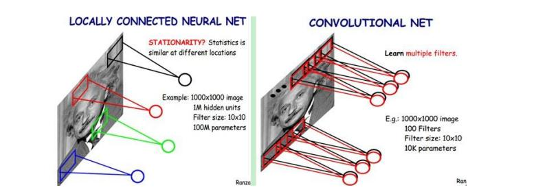

# CNN(卷积神经网络)

Li Junli 李军利  /  25th May 2019    


## 1. 基础介绍

### 1.1 CNN历史

- CNN最早可以追溯到1968年 Hubel和Wiesel的论文，这篇论文讲述猫和猴的视觉皮层含有对视野的小区域单独反应的神经元，如果眼睛没有移动，则视觉刺激影响单个神经元的视觉空间区域被称为其**感受野**（Receptive Field）。相邻细胞具有相似和重叠的感受野。感受野大小和位置在皮层之间系统地变化，形成完整的视觉空间图。这个为CNN的局部感知奠定了一个基础。
- 然后是1980年，**神经感知机**(neocognitron)的提出，标志了第一个初始的卷积神经网络的诞生，也是感受野概念在人工神经网络领域的首次应用，神经认知机将一个视觉模式分解成许多子模式（特征），然后进入分层递阶式相连的特征平面进行处理。
- 在然后1988年，**时不变神经网络**(Shift-invariant neural network)的提出，将卷积神经网络的功能进行了一次提高，使其能够在即使物体有位移或轻微变形的时候，也能完成识别。
- 卷积神经网络的前馈架构在**神经抽象金字塔**（Neural abstraction pyramid）中被横向和反馈连接扩展。所产生的复现卷积网络允许灵活地并入情景信息以迭代地解决局部模糊。与以前的模型相反，产生了最高分辨率的图像输出。
- 最后，2005出现了一篇GPU实现CNN的paper，标志了一种实现CNN更有效的方式，之后在2012年ImageNet大赛中CNN由于其高精确度脱颖而出，于是，深度学习正式进入人们的视野。


### 1.2 CNN 概述

**卷积神经网络（Convolutional Neural Network, CNN）**是一种前馈神经网络，它的人工神经元可以响应一部分覆盖范围内的周围单元，对于大型图像处理有出色表现。

CNN由输入和输出层以及多个隐藏层组成，隐藏层可分为**卷积层**，**池化层**、**RELU层**和**全连接层**。

相比于传统的神经网络，CNN主要有三大特色，分别是**局部感知**、**权重共享**和**多卷积核**。


<center>全连接神经网络</center>


<center>卷积神经网络</center>


**一般CNN结构依次为**

```
1. INPUT
2. [[CONV -> RELU]*N -> POOL?]*M
3. [FC -> RELU]*K
4. FC
```


**卷积神经网络之训练算法**

```
1. 同一般机器学习算法，先定义Loss function，衡量和实际结果之间差距

2. 找到最小化损失函数的W和b， CNN中用的算法是SGD（随机梯度下降）
```


**卷积神经网络之优缺点**

```
优点
　　• 共享卷积核，对高维数据处理无压力
　　• 无需手动选取特征，训练好权重，即得特征分类效果好
缺点
　　• 需要调参，需要大样本量，训练最好要GPU
　　• 物理含义不明确
　　  也就说，我们并不知道没个卷积层到底提取到的是什么特征，而且神经网络本身就是一种难以解释的“黑箱模型”
```


**卷积神经网络之 fine-tuning**

```
fine-tuning就是使用已用于其他目标、预训练好模型的权重或者部分权重，作为初始值开始训练
那为什么不用随机选取选几个数作为权重初始值？原因很简单:
  　• 自己从头训练卷积神经网络容易出现问题
　  • fine-tuning能很快收敛到一个较理想的状态，省时又省心。

fine-tuning的具体做法：
　　• 复用相同层的权重，新定义层取随机权重初始值
　　• 调大新定义层的的学习率，调小复用层学习率
```


1）CNN特点之**局部感知**（Local Connectivity）：

局部感知就是上面说的**感受野**，实际上就是卷积核和图像卷积的时候，每次卷积核所覆盖的像素只是一小部分，是局部特征，所以说是局部感知。CNN是一个从局部到整体的过程（局部到整体的实现是在全连通层），而传统的神经网络是整体的过程。

<center>全连接与局部感知对比</center>


2）CNN特点之**参数共享**（Parameter Sharing）：

传统的神经网络的参数量是非常巨大的，比如1000 * 1000像素的图片，映射到和自己相同的大小，需要（1000 * 1000）的平方，也就是10的12次方个参数，参数量太大了，而CNN除全连接层外，卷积层的参数完全取决于滤波器的设置大小，比如10 * 10的滤波器，这样只有100个参数，当然滤波器的个数不止一个，也就是下面要说的多卷积核。但与传统的神经网络相比，参数量小，计算量小。整个图片共享一组滤波器的参数。


3）CNN特点之**多卷积核**：

一种卷积核代表的是一种特征，为获得更多不同的特征集合，卷积层会有多个卷积核，生成不同的特征，这也是为什么卷积后的图片有高度，每一个图片代表不同的特征。


## 2. CNN网络结构

**卷积神经网络的层级结构**

```
•	数据输入层/ Input layer
•	卷积计算层/ CONV layer
•	ReLU激励层 / ReLU layer
•	池化层 / Pooling layer
•	全连接层 / FC layer
```


### 2.1 数据输入层

该层可能要做的主要是对原始图像数据进行预处理，其中包括

```
• 去均值：把输入数据各个维度都中心化为0，如下图所示，其目的就是把样本的中心拉回到坐标系原点上

• 归一化：幅度归一化到同样的范围，如下所示，即减少各维度数据取值范围的差异而带来的干扰，比如，我们有两个维
  度的特征A和B，A范围是0到10，而B范围是0到10000，如果直接使用这两个特征是有问题的，好的做法就是归一化，
  即A和B的数据都变为0到1的范围

• PCA/白化：用PCA降维；白化是对数据各个特征轴上的幅度归一化
```


<center>去均值与归一化效果图</center>


<center>去相关与白化效果图</center>


### 2.2 卷积层

这一层就是卷积神经网络最重要的一个层次，也是“卷积神经网络”的名字来源。

在这个卷积层，有两个关键操作

```
• 局部关联。每个神经元看做一个滤波器(filter)
• 窗口(receptive field)滑动， filter对局部数据计算
```


#### 2.2.1 概述

卷积神经网络里面的这个卷积和信号里面的卷积是有些差别的，信号中的卷积计算分为镜像相乘相加，卷积层中的卷积没有镜像这一操作，直接是相乘和相加，如下图所示


最左边的是卷积的输入，中间的为卷积核，最右边的为卷积的输出。可以发现卷积计算很简单，就是卷积核与输入对应位置相乘然后求和。除了图中绿颜色的例子，我们可以计算一下图中红色圈对应的卷积结果：

(-1) * 2 + (-1) * 9 + (-1) * 2 + 1 * 4 + 1 * 4 = -5。以上就是卷积计算的过程，对于整个输入来说，计算结果还取决于两个参数：padding 和 stride,下面分别介绍下这两个参数以及 **多通道计算**。

**Zero Padding**（填充）：

```
在Tensorflow中卷积函数里padding有两种属性，一种是valid，这种表示不需要padding操作，假设输入大小为n * n,卷积核大小为f * f，此时输出大小为（n-f+1)；另一种是same，表示输入和输出的大小相同，假设padding的大小为p，此时为了保持输出和输入消息相同 p = (f-1)/2，但是此时卷积核要是奇数大小。（注意默认步长等于1的条件下）
```

举个zero-padding 的例子，假如input 一个 5 * 5 * 3 的图片，滑动窗口取2 * 2，步长取2，最后还剩下1个像素没法滑完，那怎么办呢？我们在原先的矩阵加了一层填充值，使得变成6*6的矩阵，那么窗口就可以刚好把所有像素遍历完。这就是填充值的作用。


**Stride** （步长）：

stride是指卷积核在输入上移动时每次移动的距离。加入stride后，输出的计算有一些变化，假设输入大小为

n * n，卷积核大小为f * f，padding大小为p，stride大小为 s,那么最后的输出大小为
$$
[\frac{n + 2p - f}{s}] + 1
$$
p = 0， s = 1 时即是 （n-f+1)。

举个代码的例子，下面两行代码是Tensorflow进行卷积计算的代码，x为输入，W为权重，strides = [b, h , w, c],其中b表示在样本(batch)上的步长，默认为1，表示每个样本都会进行计算；h, w表示高度和宽度，即横向和纵向步长；c表示通道数，默认为1，表示每个通道都会参与计算。简单来说，b表示在选取的batch上滑动，默认是一个样本一个样本地滑；h和w表示上下和左右滑动的步长，c表示在通道上滑动的步长（前后滑动），默认是一个通道一个通道地滑。b和c，还没遇到不设置为1的情况。h和w默认也是1,样本来说h=w。

```python
# tf.nn.conv2d(input, fileter, strides, padding, use_cudnn_on_gpu=True, name=None)
tf.nn.conv2d(x, W, strides=[1, 1, 1, 1], padding='SAME')
tf.nn.conv2d(x, W, strides=[1, 2, 2, 1], padding='VALID')
```


**多通道计算**

```
卷积核除了长宽这两个自己指定的参数之外还有通道数这个参数，首先需要明确的是单个卷积核的通道数要等于上一层图像的通道数，一般图像是RGB模式的话，第一层单个卷积核的大小为为h*w*3。用吴恩达的视频内容讲解一下，只有一个卷积核的时候，计算方法简单粗暴，先是每个通道的对应位置与上一层感受野相乘，然后将不同通道数之间相加，最终只得到一个通道。若该层有10个卷积核，就是10个feature map, 下一层卷积核的通道数就是 10了。

-----------------------------------------------------------------------------------------
这里的通道说的可能有点懵哈，简单说就是本层卷积核的通道数等于上一层卷积核的个数。上一层上原始图像时，通道数就等于原图像的深度。上一层的out_channels = 下一层的 in_channels
-----------------------------------------------------------------------------------------

如下图，假设现有一个为 6×6×3 的图片样本，使用 3×3×3 的卷积核（filter）进行卷积操作。此时输入图片的 channels 为 3 ，而卷积核中的 in_channels 与 需要进行卷积操作的数据的 channels 一致（这里就是图片样本，为3）。接下来，进行卷积操作，卷积核中的27个数字与分别与样本对应相乘后，再进行求和，得到第一个结果。
步长为1，依次进行滑动，最终得到 4×4 的结果。
```

<center>3通道一个卷积核</center>


一般卷积核不止一个，对于多个卷积核的情况也不复杂，直接对每个卷积核进行单个卷积核的操作，然后把它们拼在一起就行了。

<center>3通道多个卷积核</center>


#### 2.2.2 详述

文字的表述总是乏力的，如果读者看完2.2.1 的概述还是对CNN一头雾水，可以接着看本小节的详述，相比2.2.1 补充了很多名词解释和图片。


**feather map**

```
在cnn的每个卷积层，数据都是以三维形式存在的。你可以把它看成许多个二维图片叠在一起（像豆腐皮一样），其中每一个称为一个feature map。feather map 是怎么生成的？

输入层：在输入层，如果是灰度图片，那就只有一个feature map；如果是彩色图片，一般就是3个feature map（红绿蓝）。
其它层：层与层之间会有若干个卷积核（kernel）（也称为过滤器），上一层每个feature map跟每个卷积核做卷积，都会产生下一层的一个feature map，有N个卷积核，下层就会产生N个feather map。


多个feather map的作用是什么？

在卷积神经网络中，我们希望用一个网络模拟视觉通路的特性，分层的概念是自底向上构造简单到复杂的神经元。
我们希望构造一组基，这组基能够形成对于一个事物完备的描述，例如描述一个人时我们通过描述身高/体重/相貌等，在卷积网中也是如此。在同一层，我们希望得到对于一张图片多种角度的描述，具体来讲就是用多种不同的卷积核对图像进行卷，得到不同核（这里的核可以理解为描述）上的响应，作为图像的特征。他们的联系在于形成图像在同一层次不同基上的描述。

下层的核主要是一些简单的边缘检测器（也可以理解为生理学上的simple cell）。
上层的核主要是一些简单核的叠加（或者用其他词更贴切），可以理解为complex cell。

 
多少个Feature Map比较合适呢？

真的不好说，简单问题少，复杂问题多，但是自底向上一般是核的数量在逐渐变多（当然也有例外，如Alexnet），主要靠经验。
```


**卷积核的理解**

```
卷积核在有的文档里也称为过滤器（filter）
  • 每个卷积核具有长宽深三个维度；
  • 在某个卷积层中，可以有多个卷积核：下一层需要多少个feather map，本层就需要多少个卷积核。
```


**卷积核的形状**

```
每个卷积核具有长、宽、深三个维度。在CNN的一个卷积层中：
  • 卷积核的长、宽都是人为指定的，长X宽也被称为卷积核的尺寸，常用的尺寸为3X3，5X5等；
  • 卷积核的深度与当前图像的深度（feather map的张数）相同，所以指定卷积核时，只需指定其长和宽 两个参数。
    例如，在原始图像层 （输入层），如果图像是灰度图像，其feather map数量为1，则卷积核的深度也就是1；如果
    图像是grb图像，其feather map数量为3，则卷积核的深度也就是3.
```


**卷积核个数的理解**

```
如下图红线所示：该层卷积核的个数，有多少个卷积核，经过卷积就会产生多少个feature map，也就是下图中 `豆腐皮儿`的层数、同时也是下图`豆腐块`的深度（宽度）！！这个宽度可以手动指定，一般网络越深的地方这个值越大，因为随着网络的加深，feature map的长宽尺寸缩小，本卷积层的每个map提取的特征越具有代表性（精华部分），所以后一层卷积层需要增加feature map的数量，才能更充分的提取出前一层的特征，一般是成倍增加（不过具体会根据实验情况具体设置）！
```


**卷积核的运算过程**

```
例如输入224 * 224 * 3（rgb三通道），输出是32位深度，卷积核尺寸为5x5。

那么我们需要32个卷积核，每一个的尺寸为5x5x3（最后的3就是原图的rgb位深3），每一个卷积核的每一层是5x5（共3层）分别与原图的每层224x224卷积，然后将得到的三张新图叠加（算术求和），变成一张新的feature map。 每一个卷积核都这样操作，就可以得到32张新的feature map了。  也就是说：

不管输入图像的深度为多少，经过一个卷积核（filter），最后都通过下面的公式变成一个深度为1的特征图。不同的filter可以卷积得到不同的特征，也就是得到不同的feature map。
```


**filter的理解**

```
filter有两种理解： 

在有的文档中，一个filter等同于一个卷积核：只是指定了卷积核的长宽深；

而有的情况（例如tensorflow等框架中，filter参数通常指定了卷积核的长、宽、深、个数四个参数），filter包含了卷积核形状和卷积核数量的概念：即filter既指定了卷积核的长宽深，也指定了卷积核的数量。
```


**卷积的计算**

注意，下面蓝色矩阵周围有一圈灰色的框，那些就是上面所说到的填充值

这里的蓝色矩阵就是输入的图像，粉色矩阵就是卷积层的神经元，这里表示了有两个神经元（w0,w1）。绿色矩阵就是经过卷积运算后的输出矩阵，这里的步长设置为2。


蓝色的矩阵(输入图像)对粉色的矩阵（filter）进行矩阵内积计算并将三个内积运算的结果与偏置值b相加（比如上面图的计算：2+（-2+1-2）+（1-2-2） + 1= 2 - 3 - 3 + 1 = -3），计算后的值就是绿框矩阵的一个元素。


下面的动态图形象地展示了卷积层的计算过程：


**参数共享机制**	

```
在卷积层中每个神经元连接数据窗的权重是固定的，每个神经元只关注一个特性。神经元就是图像处理中的滤波器，比如边缘检测专用的Sobel滤波器，即卷积层的每个滤波器都会有自己所关注一个图像特征，比如垂直边缘，水平边缘，颜色，纹理等等，这些所有神经元加起来就好比就是整张图像的特征提取器集合。
```


### 2.3 池化层

池化层（pooling）夹在连续的卷积层中间， 用于降低维度，压缩数据和参数的量，减小过拟合。

简而言之，如果输入是图像的话，那么池化层的最主要作用就是压缩图像。

池化操作规模一般为 2＊2，步幅为2，对每个深度切片进行下采样**（downsamples）**，所以池化后深度不变。

通过对卷积后的结果进行降采样来降低维度，一般分为最大池化和平均池化两类（高斯和可训练池化不常用）。


**最大池化**

最大池化顾名思义，降采样的时候采用最大值的方式采样，如图所示，其中池化核的大小为2 * 2，步长也为2 * 2


**平均池化**

平均池化就是用局部的平均值作为采样的值，还是上面的数据，平均池化后的结果为：


代码, 其中的ksize的参数和stride差不多，2.1中有解释stride，不再赘述。

```python
tf.nn.max_pool(x, ksize=[1, 2, 2, 1], stride=[1, 2, 2, 1], padding='SAME')
tf.nn.avg_pool(x, ksize=[1, 2, 2, 1], stride=[1, 2, 2, 1], padding='SAME')
```


**展开叙述池化层的具体作用**

```
1. 特征不变性，也就是我们在图像处理中经常提到的特征的尺度不变性，池化操作就是图像的resize，平时一张狗的图像被缩小了一倍我们还能认出这是一张狗的照片，这说明这张图像中仍保留着狗最重要的特征，我们一看就能判断图像中画的是一只狗，图像压缩时去掉的信息只是一些无关紧要的信息，而留下的信息则是具有尺度不变性的特征，是最能表达图像的特征。

2. 特征降维，我们知道一幅图像含有的信息是很大的，特征也很多，但是有些信息对于我们做图像任务时没有太多用途或者有重复，我们可以把这类冗余信息去除，把最重要的特征抽取出来，这也是池化操作的一大作用。

3. 在一定程度上防止过拟合，更方便优化。
```


卷积后的Feature Map 有对于识别物体不必要的冗余信息，所以pooling不会损坏识别结果。但是pooling 也有不好的地方，就是可能会丢失某些重要信息，这些信息对结果的判断也有影响。还有一些声音说pooling实际上没有用，但是我们一般都是加池化层的。

<center>池化下采样过程</center>



### 2.4. 全连接层

全连接层就是把卷积层和池化层的输出展开成一维形式，在后面接上与普通网络结构相同的回归网络或者分类网络，一般接在池化层后面，如图所示



用代码会更好理解一些,其中dims为池化层展开成一维数组的维度，第二行采用relu作为全连接层的激活函数。

```python
fc = tf.reshape(pool_out,[-1, dims])
fc_out = tf.nn.relu(tf.matmul(fc, W_fc) + b_fc)
```


## 3. 避免过拟合

避免过拟合的方法:

      1）增加训练数据数量
        对图片还可增加噪声、数据增强(旋转、裁剪、光照、翻转)等2)减小网络规模(- 般不这样做)
      
      2）减少网络规模（不推荐）
      
      3) 正则化: 
         网络大部分都有较小的权重，小权重意味着网络的行为不会因为随意更改了一些输入而改变太多。这使得它不容易学 
         习到数据中局部噪声。可以把它想象成一种能使孤: 立的数据不会过多影响网络输出的方法)正则化网络能够限制在
         对训练数据中常见数据构建出相对简单的模型,并且对训练数据中的各种各样的噪声有较好的抵抗能力。有助于学习
         到问题中现象的本质，并且能更好的进行泛化。
         
         下面给出了一种常用的优化策略分为两步:
         1、通过零均值化每一层的输入，使每一层拥有服从相同分布的输入样本.因此克服内部协方差偏移的影响。
         2、数据简化:输入样本X规模可能上亿，直接计算几乎是不可能的。因此，选择每个batch来进行Normalization
         
         训练深度网络时,神经网络隐层参数更新会导致网络输出层输出数据的分布发生变化，而且随着层数的增加，根据链
         式规则，这种偏移现象会逐渐被放大。Batch Normalization 作为深度网络模型的一个层，每次先对input数
         据进行归一化，再送入神经网络输入层。
         dropout是一种正则化的方法，很常用，下面单独讲述。
<center>Batch Normalization</center>


**dropout**也是一种**正则化**的方法，应用在CNN中，主要解决**CNN过拟合**的问题。

 **具体做法**:

在每个隐藏层的输入进行一个概率判决，比如我们设置概率为0.5（通常命名为keep_prob）,根据0.5，我们生成一个跟隐藏层神经元个数相同的向量，true:false的比例是1：1（因为keep_prob=0.5），与隐藏层的输入进行相乘，那么会有一半隐藏层的神经元被丢掉，不起作用，整个网络变得简单了，就会从过拟合过渡到just  right 。这是组合派的说法，andrew也是这么讲的。

图形理解（这个keep_prob等于0.4，即2/5）：




## 4. AlexNet代码实例

下面以AlexNet为例子，给出一个详细的卷积神经网络架构，首先AlexNet架构及每部分学习到的特征如下图所示



代码如下：

```
import tensorflow as tf
import numpy as np
# 定义各层功能
# 最大池化层
def maxPoolLayer(x, kHeight, kWidth, strideX, strideY, name, padding = "SAME"):
    """max-pooling"""
    return tf.nn.max_pool(x, ksize = [1, kHeight, kWidth, 1],
                          strides = [1, strideX, strideY, 1], padding = padding, 
                          name = name)
 
# dropout
def dropout(x, keepPro, name = None):
    """dropout"""
    return tf.nn.dropout(x, keepPro, name)
 
# 归一化层
def LRN(x, R, alpha, beta, name = None, bias = 1.0):
    """LRN"""
    return tf.nn.local_response_normalization(x, depth_radius = R, alpha = alpha,
                                              beta = beta, bias = bias, name = name)
 
# 全连接层
def fcLayer(x, inputD, outputD, reluFlag, name):
    """fully-connect"""
    with tf.variable_scope(name) as scope:
        w = tf.get_variable("w", shape = [inputD, outputD], dtype = "float")
        b = tf.get_variable("b", [outputD], dtype = "float")
        out = tf.nn.xw_plus_b(x, w, b, name = scope.name)
        if reluFlag:
            return tf.nn.relu(out)
        else:
            return out
 
# 卷积层
def convLayer(x, kHeight, kWidth, strideX, strideY,
              featureNum, name, padding = "SAME", groups = 1):
    """convolution"""
    channel = int(x.get_shape()[-1])
    conv = lambda a, b: tf.nn.conv2d(a, b, strides = [1, strideY, strideX, 1], 
                                     padding = padding)
    with tf.variable_scope(name) as scope:
        w = tf.get_variable("w", shape = [kHeight, kWidth, channel/groups, featureNum])
        b = tf.get_variable("b", shape = [featureNum])
 
        xNew = tf.split(value = x, num_or_size_splits = groups, axis = 3)
        wNew = tf.split(value = w, num_or_size_splits = groups, axis = 3)
 
        featureMap = [conv(t1, t2) for t1, t2 in zip(xNew, wNew)]
        mergeFeatureMap = tf.concat(axis = 3, values = featureMap)
        # print mergeFeatureMap.shape
        out = tf.nn.bias_add(mergeFeatureMap, b)
        return tf.nn.relu(tf.reshape(out, mergeFeatureMap.get_shape().as_list()), 
                                     name = scope.name)
 
class alexNet(object):
    """alexNet model"""
    def __init__(self, x, keepPro, classNum, skip, modelPath = "bvlc_alexnet.npy"):
        self.X = x
        self.KEEPPRO = keepPro
        self.CLASSNUM = classNum
        self.SKIP = skip
        self.MODELPATH = modelPath
        #build CNN
        self.buildCNN()
 
    # 构建AlexNet
    def buildCNN(self):
        """build model"""
        conv1 = convLayer(self.X, 11, 11, 4, 4, 96, "conv1", "VALID")
        lrn1 = LRN(conv1, 2, 2e-05, 0.75, "norm1")
        pool1 = maxPoolLayer(lrn1, 3, 3, 2, 2, "pool1", "VALID")
 
        conv2 = convLayer(pool1, 5, 5, 1, 1, 256, "conv2", groups = 2)
        lrn2 = LRN(conv2, 2, 2e-05, 0.75, "lrn2")
        pool2 = maxPoolLayer(lrn2, 3, 3, 2, 2, "pool2", "VALID")
 
        conv3 = convLayer(pool2, 3, 3, 1, 1, 384, "conv3")
 
        conv4 = convLayer(conv3, 3, 3, 1, 1, 384, "conv4", groups = 2)
 
        conv5 = convLayer(conv4, 3, 3, 1, 1, 256, "conv5", groups = 2)
        pool5 = maxPoolLayer(conv5, 3, 3, 2, 2, "pool5", "VALID")
 
        fcIn = tf.reshape(pool5, [-1, 256 * 6 * 6])
        fc1 = fcLayer(fcIn, 256 * 6 * 6, 4096, True, "fc6")
        dropout1 = dropout(fc1, self.KEEPPRO)
 
        fc2 = fcLayer(dropout1, 4096, 4096, True, "fc7")
        dropout2 = dropout(fc2, self.KEEPPRO)
 
        self.fc3 = fcLayer(dropout2, 4096, self.CLASSNUM, True, "fc8")
 
    def loadModel(self, sess):
        """load model"""
        wDict = np.load(self.MODELPATH, encoding = "bytes").item()
        #for layers in model
        for name in wDict:
            if name not in self.SKIP:
                with tf.variable_scope(name, reuse = True):
                    for p in wDict[name]:
                        if len(p.shape) == 1:
                            #bias
                            sess.run(tf.get_variable('b', trainable = False).assign(p))
                        else:
                            #weights
                            sess.run(tf.get_variable('w', trainable = False).assign(p))
```


## 5. 小结

卷积网络在本质上是一种输入到输出的映射，它能够学习大量的输入与输出之间的映射关系，而不需要任何输入和输出之间的精确的数学表达式，只要用已知的模式对卷积网络加以训练，网络就具有输入输出对之间的映射能力。

CNN一个非常重要的特点就是头重脚轻（越往输入权值越小，越往输出权值越多），呈现出一个倒三角的形态，这就很好地避免了BP神经网络中反向传播的时候梯度损失得太快。

卷积神经网络CNN主要用来识别位移、缩放及其他形式扭曲不变性的二维图形。由于CNN的特征检测层通过训练数据进行学习，所以在使用CNN时，避免了显式的特征抽取，而隐式地从训练数据中进行学习；再者由于同一特征映射面上的神经元权值相同，所以网络可以并行学习，这也是卷积网络相对于神经元彼此相连网络的一大优势。卷积神经网络以其局部权值共享的特殊结构在语音识别和图像处理方面有着独特的优越性，其布局更接近于实际的生物神经网络，权值共享降低了网络的复杂性，特别是多维输入向量的图像可以直接输入网络这一特点避免了特征提取和分类过程中数据重建的复杂度。


**解决BP神经网络 全连接参数过多的问题**

```
卷积神经网络有两种神器可以降低参数数目。
• 第一种神器叫做局部感知野，一般认为人对外界的认知是从局部到全局的，而图像的空间联系也是局部的像素联系较为
  紧密，而距离较远的像素相关性则较弱。因而，每个神经元其实没有必要对全局图像进行感知，只需要对局部进行感
  知，然后在更高层将局部的信息综合起来就得到了全局的信息。
• 第二级神器，即权值共享。
```


**采样窗口彼此重叠，解决边缘过渡不平滑**




## 声明

除了个人原创内容，本文参考了一些博客、书籍、和课程（尤其是图片的引用），在此对作者们表示感谢！

转载请标明来源 [github地址](https://github.com/Ljl-Jdsk/)	


## References

\[1] [CNN百度百科](https://baike.baidu.com/item/%E5%8D%B7%E7%A7%AF%E7%A5%9E%E7%BB%8F%E7%BD%91%E7%BB%9C/17541100?fr=aladdin)

\[2] [机器学习算法之卷积神经网络CNN](https://blog.csdn.net/sinat_35821976/article/details/78700377)

[3] [从零开始搭建神经网络](https://blog.csdn.net/sinat_35821976/article/details/81503953#%E5%86%85%E5%AE%B9%E4%BB%8B%E7%BB%8D)

\[4] [详解CNN](https://blog.csdn.net/liangchunjiang/article/details/79030681)

\[5] [CNN总结](https://www.cnblogs.com/skyfsm/p/6790245.html)

\[6] [初探CNN](https://www.cnblogs.com/fydeblog/p/7450413.html)

[7] 郑泽宇, 顾思宇.TensorFlow实战谷歌深度学习框架.中国工信出版集团, 电子工业出版社

[8] 吴恩达机器学习课程.网易云课堂

\[9] [卷积名词解释](https://blog.csdn.net/xys430381_1/article/details/82529397)